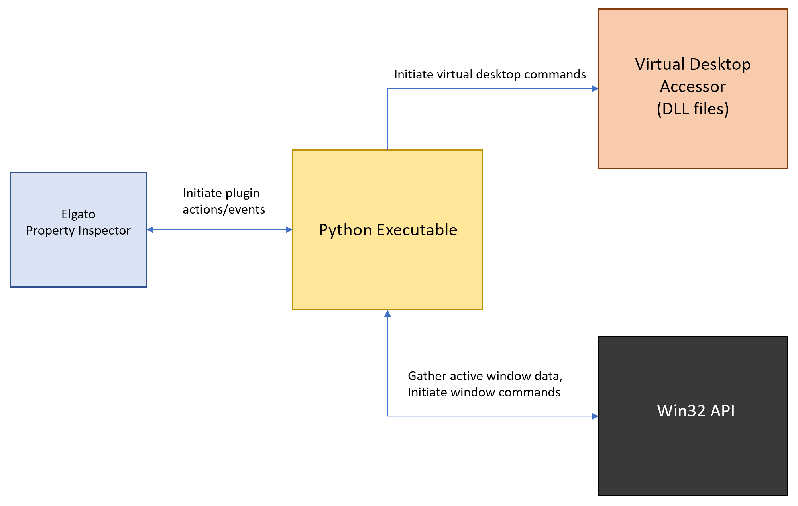

# Window Actions Elgato Plugin

This plugin allows a user to perform window-specific actions on window, with a tap of a button or through a multi-action sequence, while using an [Elgato Stream Deck](https://www.elgato.com/en/stream-deck)

# Quickstart

Download the following [setup file](https://github.com/aasmal97/Window-Actions/releases/tag/v2.1.0)

### Pre-requisites

- StreamDeck 4.1 +
- Windows 10+

# Description

The Elgato Stream Deck natively supports a [open system action](https://help.elgato.com/hc/en-us/articles/360028234471-Elgato-Stream-Deck-System-Actions-Hotkey-Open-Website-Multimedia-#h_01G93K00TJB5BHV93JTTJ0YV80), which can be used to open any application you need. However, it lacks the ability to perform window actions of the windows that this action creates. When setting up a multi-action workflow, streaming, or recording, these actions are almost essential to have, since multiple applications need to be hidden or focused in.

This app allows users to use an Elgato Stream Deck to minimize, close, maximize, resize or move windows a Windows 10+ machine. It also supports Virtual Desktops and allows for their creation and navigation

# Alternative Workaround

On a Windows 10+ machine, a workaround to perform these window actions (minimize, close, maximize, resize or move), would be to download [`nircmd`](https://www.nirsoft.net/utils/nircmd.html), and create a `.bat` file, that when opened, runs a series of commands to perform such actions. However, this comes with the following problems:

1. It's tedious to configure a different `.bat` file for every window action needed
2. This requires learning the Windows OS CLI (Command Prompt or Powershell).
3. It's difficult to change the workflow in the future, as it requires manually updating a new [window identifier](#window-identifiers) in the `.bat` file directly. This may be necessary if an application updates itself and it's identifiers change, or if an action was configured for a one-time use case using `hwid`.
4. `nircmd` does not support virtual desktops (moving or navigating through them)
5. `nircmd` is over decade old, and is potentially outdated and includes secruity vulnerabilities

   To amend these problems, this app/plugin was developed

# How This Plugin Works

### General Architecture

### Initiating Window Action Commands

 This app uses the [Win32 API](https://learn.microsoft.com/en-us/windows/win32/apiindex/windows-api-list) to initiate most window actions. We use python's [pywin32 library](https://pypi.org/project/pywin32/) to wrap around this API, and expose their actions to us. 

### Initiating Monitor/Virtual Desktop Commands

To initiate virtual desktop and monitor actions, like moving a window to another virtual desktop or monitor, we send commands to a specific version of `VirtualDesktopAccessor.dll`. The multiple dll versions are [stored here](./Sources/com.arkyasmal.windowActions.sdPlugin/app/dll). 

Documentation for these files can be [found here](https://github.com/Ciantic/VirtualDesktopAccessor)

Ultimately, This allows us to interact with the Windows 10 and 11 unoffical Virtual Desktop API. We then package these dll files with the app.
### Integrating Our App

We integrate our app with the [Elgato Stream Deck Architecture](https://developer.elgato.com/documentation/stream-deck/sdk/plugin-architecture/) by compiling our python app into an `.exe` file, using [pyinstaller](https://pyinstaller.org/en/stable/). This `.exe` file becomes the entry point/Code path that our `manifest.json` points to for the plugin.

### Configuring the Property Inspector

This is where most of the magic happens. Using Elgato's Property Inspector, we can create a simple and initutive HTML form, that accepts the required [windowIdentifier](#window-identifiers), and passes it into our plugin, to execute. The quickest way to set this up, is by using pre-populated dropdowns, that can be selected. This prevents typos, and incorrect mappings, which commonly occur when writing directly to `.bat` files.

As an added bonus, it also means users don't need to write any code to configure their actions.

### Populating Active Window Dropdown

To automatically populate a dropdown list of active/opened windows, we use python's powerful [`win32gui`](https://pypi.org/project/win32gui/#description) package. This allows us to attain all the necessary data in our `JSON` file. This is then passed to the [property inspector](#configuring-the-property-inspector), for user selection.

# Window Identifiers

The following are the valid identifier types that can be configured.

- program name/process (.exe file name)
- window title (partial or exact)
- [window handle](https://learn.microsoft.com/en-us/windows/apps/develop/ui-input/retrieve-hwnd) (`hwnd`)
- [window class name](https://learn.microsoft.com/en-us/windows/win32/winmsg/about-window-classes).
